#Jupyter Notebook 使用祕訣
###### 清大資應所 蔡念澄 整理

## Kernel
* 如果有多個 conda environments，可以`conda install nb_conda`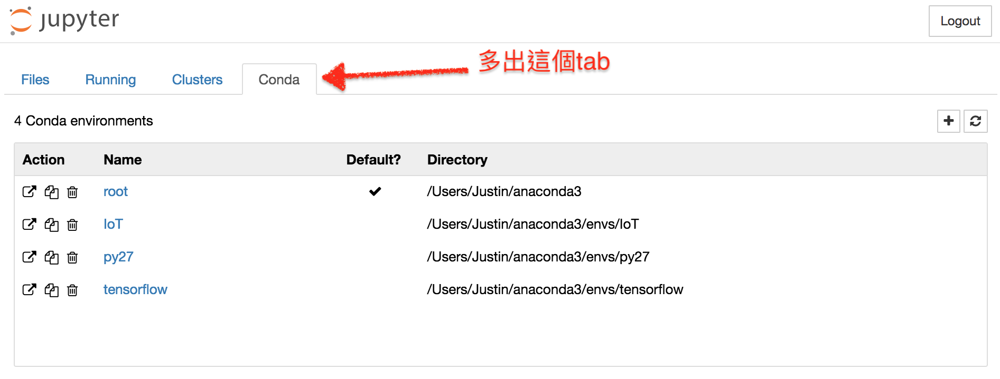

* `◼︎` interrupt kernel 其實就是 Shell 的`Ctrl`+`C`

* Kernel 沒反應時善用 "Restart"，不過所有物件需要重新建立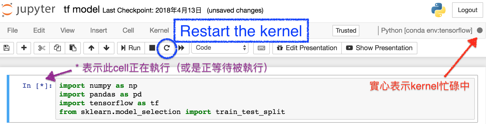

* 也可能發生網頁與 Jupyter（本地/遠端）伺服器斷線的情況，試試`Kernel > Reconnect`

* 另存新檔`File > Download as`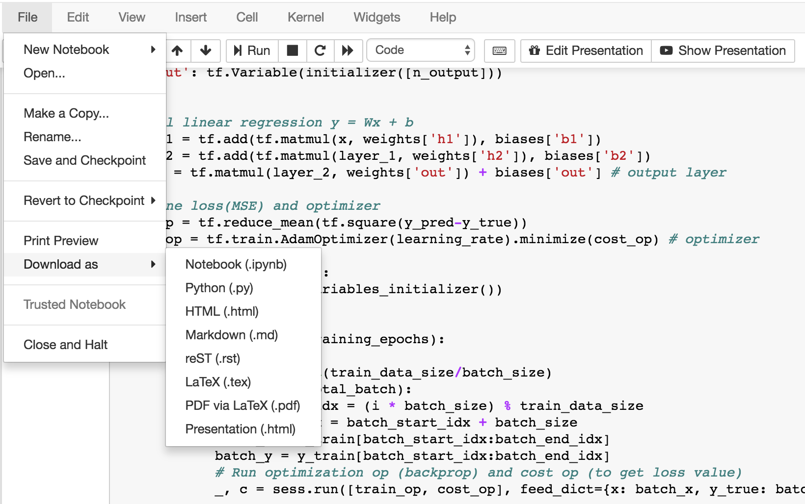

* 若不再使用 notebook，請到`File > Close and Halt`，確保 notebook 已存檔、kernel 被終止

## Cell
* `Ctrl`+`Enter` 執行所選 cells

* `Shift`+`Enter` 執行 cell 並跳到下方 cell
	* 若沒有，新的 cell 會被建立

* 點擊 code 左方區域以選擇該 cell，或在 cell 內編輯時按`Esc`（左邊框會變為藍色）

* Cell 裡可以不是程式碼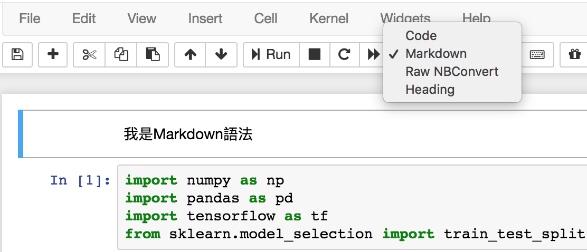
    * 點選 cell 後按`M`來改變成 markdown cell
    * Markdown 用 LaTeX 寫公式，會藉由 MathJax 渲染，例如
    `$$ P(A \mid B) = \frac{P(B \mid A) \, P(A)}{P(B)} $$`

* Cell 的最後一行不加`print()`便能輸出結果

	```python
	import numpy as np
	a = np.array([1, 2, 3, 4])
	a = a.reshape((-1, 1)) # <--- THIS IS THE TRICK!!!
	a
	```
	Output:
	
	```
	array([[1],
	       [2],
	       [3],
	       [4]])
	```
	
* `Ctrl`+`/` 註解一行或所選程式碼
	* macOS 也可用`⌘`+`/`

* `D`+`D` 刪除 cell

* 前面加上`!`以執行Shell 指令

	```
	!cd
	```
	* 但不要使用需要回覆的指令

* 在方法或變數前加上`?`，效果跟`help`一樣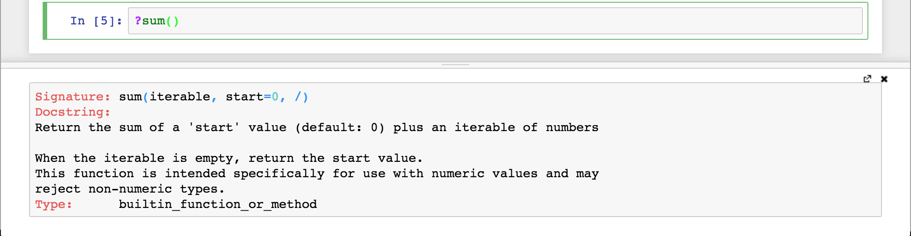

* `Esc`+`F` 尋找並取代程式碼（不包含 outputs）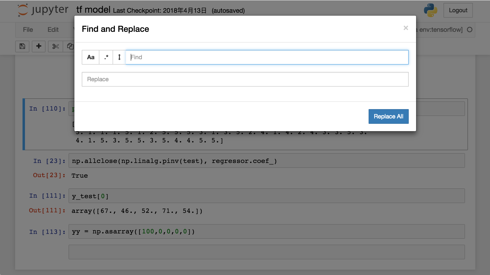

* `Esc`+`O` 或在 cell output 的左邊雙擊 「拴住(toggle) / 隱藏」cell output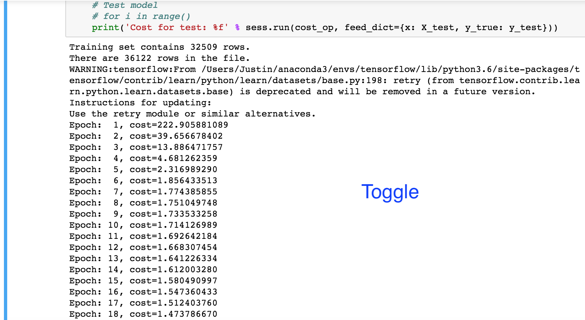

* 輸出太長時在 cell output 的左邊單擊，切換「捲動(toggle scrolling / 全部顯示(toggle)」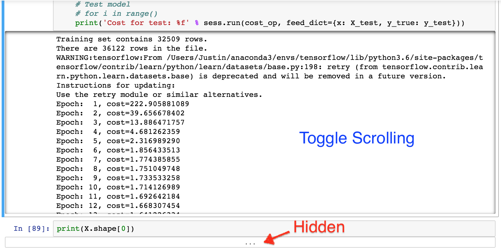

* 按`Tab`顯示候選字 (function/attribute)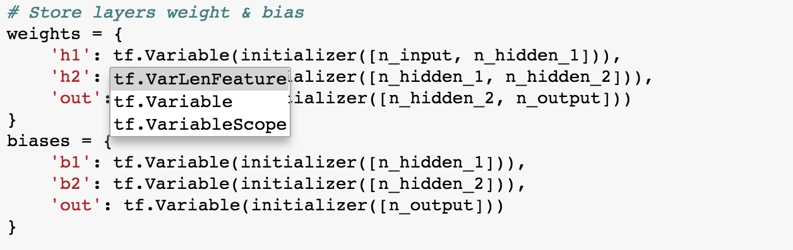

* `Shift`+`Tab` 顯示 function 的 docstring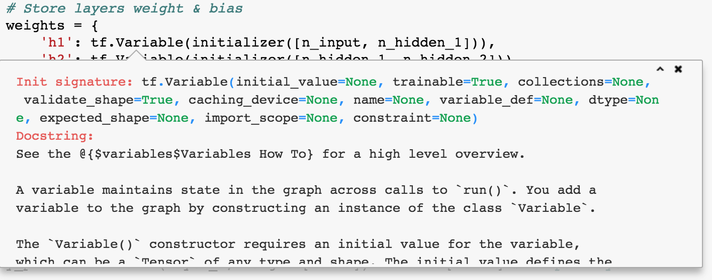

* 選擇多個 cells 後`Shift`+`M` 合併成一個 cell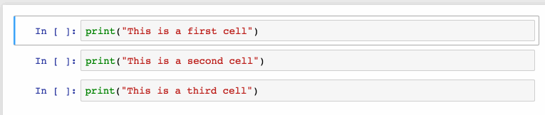

* `Alt`+`mouse selection`然後`←`/`→` 產生多行游標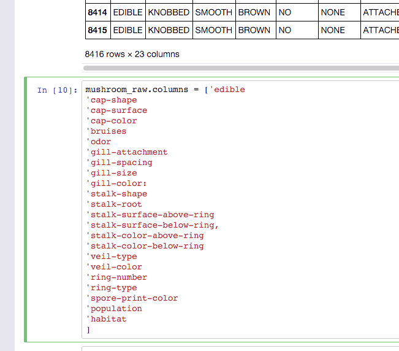

* `Ctrl`+`mouse clicks`在想要的數個地方設游標
	* 此 gif 包含上一個操作
	* macOS 上以`⌘`取代`Ctrl`

## Jupyter Magic Commands
* 最常見的是 `%matplotlib inline`，直接在 cell output 中作圖

* `%matplotlib notebook` 提供了互動性，不過可能有點延遲

* `%run`執行.py檔的 Python 程式碼，也能執行其他 jupyter notebook，例如`%run ./LinearRegression.ipynb`

* `%lsmagic` 列出所有 Jupyter Magic 指令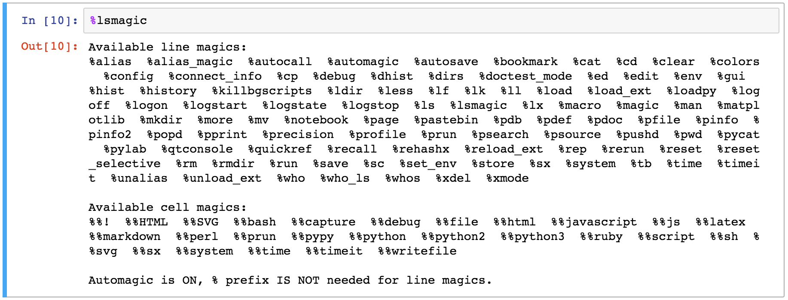

* `%time` 測量一行指令所花時間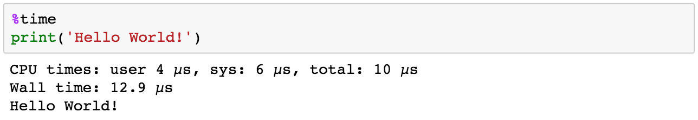

* `%%time` 測量一個 cell 執行一次所花時間

* 想要的話，可以將多個 kernel 的程式碼組合在一個 notebook 中，在每個 cell 的開頭聲明想使用的 kernel：
	* `%%bash`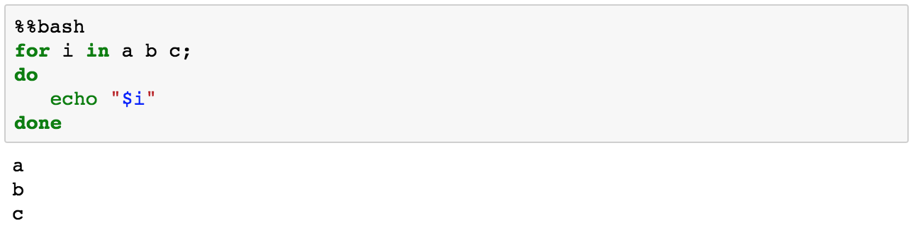
	* `%%HTML`
	* `%%python2`
	* `%%python3`
	* `%%ruby`

* `%%writefile myfile.py` (`%%file myfile.py`) 保存 cell 內容到外部文件

* `%load myfile.py` 讀取程式碼到當前的 cell